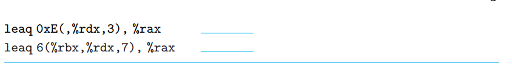

# 3-1
## problem

## answer
| Operand         | Value | comment          |
| --------------- | ----- | ---------------- |
| %rax            | 0x100 | value in rax     |
| 0x104           | 0xAB  |
| $0x108          | 0x108 |
| (%rax)          | 0xFF  | memory reference |
| 4(%rax)         | 0xAB  |
| 9(%rax, %rdx)   | 0x11  |
| 260(%rcx, %rdx) | 0x13  |
| 0xFC(, %rcx, 4) | 0xFF  |
| (%rax, %rdx, 4) | 0x11  |

## 说明
寻址模式
| format        | comment                                     |
| ------------- | ------------------------------------------- |
| (%rax)        | rax里面有值，获得这个值对应内存地址里的数据 |
| 4(%rax)       | 获得rax+4内存地址里的数据                   |
| 9(%rax, %rdx) | 获得rax+rdx+9内存地址里的数据               |

# 3-2 
## problem


## answer
- movl
- movw
- movb 
- movb
- movq
- movw

# 3-3
## problem

## answer
1. as编译没有出错，stackoverflow上有人说本题错了
2. rax，rsp都是64bit模式，movl是32bit模式
3. 源操作数和目的操作数都能都是内存地址
4. 没有sl寄存器
5. 目的操作数不能是立即数
6. 和第二题原因一致
7. si是16位寄存器

# 3-4 
## problem


## answer
```asm
# char -> int
movsbl  (%rdi), %eax
movl    %eax,   (%rsi)
```
```asm
# char -> unsigned
movsbl  (%rdi), %eax
movl    %eax,   (%rsi)

```

```asm
# unsigned char -> long
movzbq  (%rdi), %rax
movq    %rax,   (%rsi)
```
```asm
# int -> char
movl    (%rdi), %rax
movb    %al,   (%rsi)
```
```asm
# unsigned -> unsigned char
movl    (%rdi), %rax
movb    %al,   (%rsi)
```
```asm
# char -> short
movsbw   (%rdi), %ax
movw    %ax,   (%rsi)
```

## 说明
mov指令还有一些其他变种，格式如下
`mov[zs][bwlq][bwlq]`
- z，零扩展。
- s，符号扩展。

# 3-5
## problem

## answer
```c
void decode1(long *xp, long *yp, long*zp)
{
    long x = *xp;
    long y = *yp;
    long z = *zp;
    *yp = x;
    *zp = y;
    *xp = z;
}
```

# 3-6
## problem



## answer
1. q + 9
2. q + p
3. q + 3*p
4. p + 7*p + 2
5. 3*q + 0xe
6. p + 7*q + 6

## 说明
mov和lea的区别
```asm
# 将rdx寄存器中值所对应地址的数据存放到rax中
mov (%rdx), %rax

# 将rdx寄存器中的值存放到rax中
lea (%rdx), %rax
```

# 3-7
## problem

## answer 
```c
short scale3(short x, short y, short z)
{
    short t = 10*y + z + x*y;
}
```

# 3-8
## problem

## answer
| Instruction                | Destination | Value              |
| -------------------------- | ----------- | ------------------ |
| addq %rcx, (%rax)          | 0x100       | 0xFF+0x1 = 0x100   |
| subq %rdx, 8(%rax)         | 0x108       | 0xAB - 0x03 = 0xA8 |
| imulq $16, (%rax, %rdx, 8) | 0x118       | 0x110              |
| incq 16(%rax)              | 0x110       | 0x14               |
| decq %rcx                  | %rcx        | 0x00               |
| subq %rdx, %rax            | %rax        | 0xFD               |

# 3-9
## problem

## answer
```asm
# 1
salq  $4,   %rax
# 2
sarl  %cl,  %rax
```

## 说明
移位指令
- SAL，算术左移
- SHL，逻辑左移
- SAR，算术右移，填上符号位
- SHR，逻辑右移，填上0

x86-64中，移位操作的具体值存放在`%cl`寄存器中

# 3-10
## problem
题目有错误。
最后三行应该是
```asm
movq    %rdx,   %rax
movq    %rsi,   %rax
ret
```


## answer
```c
short p1 = y | z;
short p2 = p1 >> 9;
short p3 = ~p2;
short p4 = y - p3;
```
# 3-11
## problem

## answer
1. 任何一个数异或其自身都等于0
2. `mov $0, %rcx`

# 3-12
## problem

## answer

# 3-13
## problem


## answer
1. int, less(<)
2. short int, great or equal(>=)
3. unsigned char, below (<)
4. long, not equal(!=)


| num | data type     | comparison |
| --- | ------------- | ---------- |
| A   | int           | <          |
| B   | short int     | >=         |
| C   | unsigned char | <          |
| D   | long          | !=         |


## 说明
1. cmp指令   
   执行目的操作数减源操作数的隐含减法操作，并且不修改任何操作数。根据计算结果，修改溢出、符号、零、进位、辅助进位和奇偶标志位

2. set指令      
   根据条件码的内容，去设置一个单字节寄存器

# 3-14
## problem

## answer
| num | data type     | comparison |
| --- | ------------- | ---------- |
| A   | long          | >=         |
| B   | short int     | ==         |
| C   | unsigned char | >          |
| D   | int           | <=         |

## 说明
test指令，在两个操作数的对应位之间进行and操作，并根据运算结果设置符号标志位，零标志位和奇偶标志位


# 3-15
## problem

## answer
| problem | answer                     | comment                                     |
| ------- | -------------------------- | ------------------------------------------- |
| A       | 0x4003fc + 0x02 = 0x4003fe |                                             |
| B       | 0x400431 - 0x0C = 0x400425 | two’s-complement 0xF4 = decimal(-12)        |
| C       | 0x400543, 0x400545         |                                             |
| D       | 0x400560                   | two’s-complement 0xffffff73 = decimal(-141) |

## 说明
- 跳转指令相对编码规则   
    跳转指令目标地址 = 目标指令的地址 - 跳转指令后面的那条指令地址
- jmp指令    
    * 直接跳转，跳转目标作为指令的一部分被编码，例如给出一个标号作为跳转目标
    * 间接跳转，跳转目标是从寄存器或内存位置中读出的      
     jmp *%rax, 用寄存器%rax中的值作为跳转目标       
     jum *(%rax), 以%rax的值作为读地址，从内存中读出跳转目标

# 3-16
## problem

## answer


# 3-17
## problem


## answer

# 3-18
## problem

## answer
```c
short test(short x, short y, short z)
{
    short val = z + y - x;
    if(z > 5)
    {
        if(y > 2)
            val = x / z;
        else
            val = x / y;
    }
    else if(z < 3)
        val = z / y;
    return val;
}
```

# 3-18
## problem
## answer

# 3-18
## problem
## answer

# 3-18
## problem
## answer