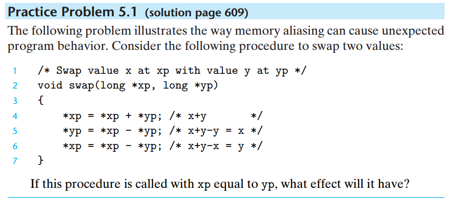

# 5-01
## problem

## answer
将*xp的值修改为0

## 说明
memory aliasing(内存别名): 不同的指针可能指向存储器中同一个位置

restrict，该关键字可以用于修饰指针，以表示指针指向内存之间不存在相互覆盖。如果用了 restrict 去修饰两个指针，而它们在作用域内又指向同一地址，那么是未定义行为。

总括而言，restrict 是为了告诉编译器额外信息（两个指针不指向同一数据），从而生成更优化的机器码。