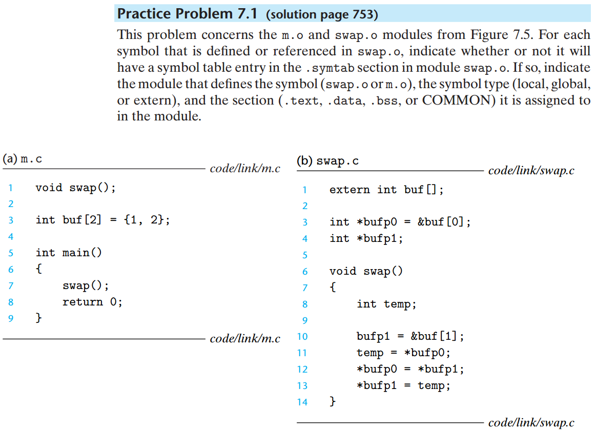

# 7-01
## problem

## answer
| Symbol | .symtab entry? | Symbol Type | Module where defined | Section |
| ------ | -------------- | ----------- | -------------------- | ------- |
| buf    | YES            | Global      | m.c                  | .data   |
| bufp0  | YES            | Global      | swap.c               | .data   |
| bufp1  | YES            | Global      | swap.c               | COMMON  |
| swap   | YES            | Global      | swap.c               | .text   |
| temp   | NO             |             |                      |         |

## 说明
- symtab(symbol table)
  * Global
  * Extern

# 7-02
## problem

## answer
| problem No. |                   answer | comment                           |
| :---------- | -----------------------: | --------------------------------- |
| A(a)        | Ref(main.1)->DEF(main.1) | 1 Strong symbol and 1 Weak symbol |
| A(b)        | Ref(main.2)->DEF(main.1) |
| B(a)        |                    Error | 2 Strong symbols                  |
| B(b)        |                    Error |
| C(a)        |       Ref(x.1)->DEF(x.2) | 1 Strong symbol and 1 Weak symbol |
| C(b)        |       Ref(x.2)->DEF(x.2) |

# 7-03
## problem
## answer

# 7-02
## problem
## answer

# 7-02
## problem
## answer

# 7-02
## problem
## answer